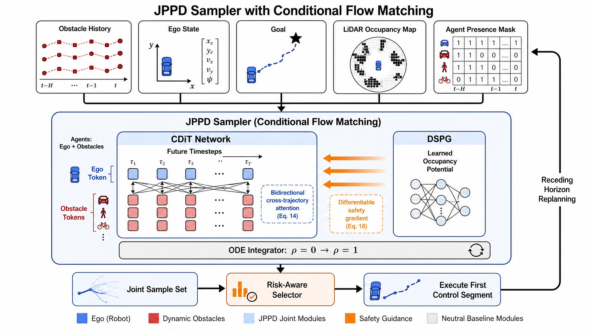
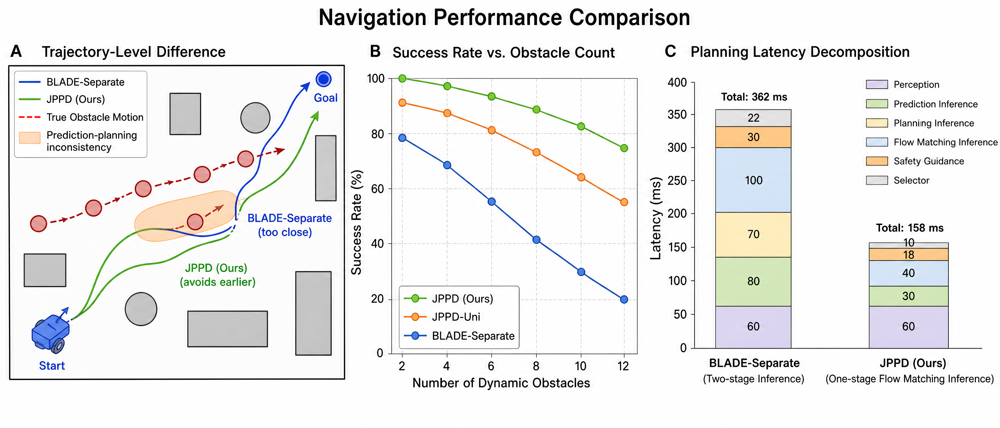

<p align="center">
  
</p>

<h1 align="center">JPPD: Joint Prediction-Planning Diffusion</h1>

<h3 align="center">
  Differentiable safety-guided joint trajectory generation for dynamic obstacle avoidance in shared-space ITS.
</h3>

<p align="center">
  
  
  
  
</p>

<p align="center">
  
  
  
  
  
</p>

<p align="center">
  <a href="#overview"></a>
  <a href="#visual-story"></a>
  <a href="#why-blade"></a>
  <a href="#method"></a>
  <a href="#results"></a>
  <a href="#repository-status"></a>
</p>

---

<p align="center">
  
  
  
  
</p>

## Overview

Shared-space mobility is no longer a clean lane-following problem. Delivery robots, pedestrians, service carts, wheelchairs, micromobility users, and low-speed autonomous platforms increasingly negotiate the same sidewalks, corridors, plazas, campus spaces, and logistics zones.

Most navigation stacks still use a separated processing flow:

```text
observe the scene -> predict participant futures -> plan ego motion -> execute
```

That pipeline is practical, but it freezes participant futures before the robot plan is selected. The robot can react to predicted participants, yet the selected robot motion cannot reshape the predicted multi-agent evolution. JPPD removes this boundary by sampling the ego future and participant futures together from one coupled distribution.

## Visual Story

| Problem Setting | Joint Architecture |
| --- | --- |
|  |  |

| Navigation Effects | ROSOrin Deployment |
| --- | --- |
|  |  |

## What JPPD Changes

|  |  |
| --- | --- |
| Predict participant futures first, then freeze them. | Sample ego and participant futures as one joint state. |
| The planner reacts to predictions, but cannot influence them. | Cross-trajectory attention lets interaction hypotheses co-evolve. |
| Safety is often added as a post-hoc repulsive field. | DSPG injects a differentiable safety gradient during sampling. |
| Sequential prediction and planning diffusion increases latency. | Conditional flow matching uses one compact sampler for fast replanning. |

The central object is a joint future tensor:

```text
Y = [ego trajectory, participant trajectory 1, ..., participant trajectory N]
```

JPPD learns and samples `p(Y | context)` directly, then executes the first ego segment in a receding-horizon loop.

## Why BLADE

In this repository and the associated manuscript discussion, **BLADE is used as a broad shorthand for a decoupled prediction-then-planning composition**. It refers to the architectural pattern where an upper component predicts obstacle or participant futures and a lower component plans the ego trajectory against those fixed futures.

We call this separated flow **BLADE** because it comes from our earlier bi-layer obstacle-avoidance design: one layer generates or predicts the surrounding dynamic scene, and another layer plans the ego motion using that already-generated scene. In other words, BLADE names a layered, decoupled decision structure rather than a single fixed codebase.

```text
BLADE-style composition: prediction module + planning module, connected sequentially.
JPPD: one joint generative sampler for prediction and planning.
```

The key contrast is conceptual. BLADE-style systems keep prediction and planning as two coupled-but-separate pieces. JPPD treats low-speed dynamic obstacle avoidance as a single joint generative decision problem.

## Method

| Component | Visual Tag | Role |
| --- | --- | --- |
| Joint Prediction-Planning Diffusion |  | Samples ego and participant futures from one conditional distribution. |
| CDiT |  | Uses agent-time tokens and cross-trajectory attention. |
| DSPG |  | Guides the sampler with a learned time-varying occupancy potential. |
| Flow Matching |  | Reduces inference steps for embedded replanning. |
| Risk-aware Selection |  | Scores complete joint futures and executes the first safe ego segment. |

Safety guidance enters the vector field itself:

```text
guided_vector_field = learned_joint_vector_field - safety_weight * grad(safety_potential)
```

This makes safety a sampling-time bias over the joint prediction-planning posterior, not a post-processing patch after a trajectory has already been generated.

## Results

The evaluation emphasizes operational shared-space metrics: near misses, blockage time, induced participant deviation, hard-braking events, collision rate, and embedded latency.

### Scenario-Grounded Shared-Space Simulation

| Method | Success | Collision | Near-miss / 100 | Blockage | Hard braking / 100 |
| --- | ---: | ---: | ---: | ---: | ---: |
| BLADE-style separated stack | 95.9% | 2.4% | 14.8 | 2.31 s/episode | 6.8 |
| JPPD-Uni | 96.7% | 1.9% | 12.6 | 2.04 s/episode | 5.3 |
| JPPD-FixedRep | 97.3% | 1.5% | 10.1 | 1.86 s/episode | 4.7 |
| **JPPD** | **98.4%** | **0.9%** | **7.2** | **1.24 s/episode** | **2.6** |

### Aggregate 2D Navigation

| Method | Success | Planning-cycle time | Path efficiency |
| --- | ---: | ---: | ---: |
| BLADE-style separated stack | 98.7% | 47 ms | 0.96 |
| JPPD-Uni | 97.8% | 31 ms | 0.96 |
| JPPD without DSPG | 96.6% | 28 ms | 0.95 |
| **JPPD** | **99.2%** | **32 ms** | **0.97** |

The measured success-rate gain should be read as a tail-risk reduction. At high baseline success rates, the remaining failures are difficult, safety-critical cases such as near-simultaneous crossings, short-horizon reversals, or crowded local minima.

## ROSOrin Deployment

JPPD was validated in simulation, naturalistic pedestrian replay, Isaac Sim, and physical ROSOrin trials. The deployment interface exposes joint ego-participant futures, DSPG risk regions, selected ego trajectory, and the first receding-horizon control segment.

| Scenario | Obstacles | Success | Collision | Mean Time | Control Rate |
| --- | ---: | ---: | ---: | ---: | ---: |
| Open | 2S + 0D | 50/50 | 0 | 9.1 s | 13.6 Hz |
| Corridor | 3S + 0D | 49/50 | 0 | 11.7 s | 13.1 Hz |
| Cluttered | 2S + 2D | 47/50 | 1 | 13.9 s | 12.4 Hz |
| Dynamic | 1S + 4D | 45/50 | 2 | 16.1 s | 11.9 Hz |
| **Overall** | **mixed** | **191/200** | **3** | **12.7 s** | **12.8 Hz** |

The observed failures were dominated by LiDAR track merging, sudden participant reversals, and localization drift, which are explicitly outside the claim of formal safety certification.

## Repository Status

This repository is currently maintained as the public project page for the JPPD manuscript.

| Directory | Purpose |
| --- | --- |
| `assets/` | Figures used by this README. |
| `docs/` | Method notes, release plan, and citation material. |
| `src/` | Placeholder for the future JPPD implementation. |
| `experiments/` | Placeholder for benchmark and reproduction scripts. |
| `checkpoints/` | Placeholder for trained CDiT and DSPG weights. |
| `data/` | Placeholder for dataset preparation scripts and metadata. |
| `logs/` | Placeholder for simulation, Isaac Sim, and ROSOrin trial logs. |

The full code, trained models, simulation configurations, and real-robot trial logs are planned for public release after the paper review and release process are complete. The placeholders are intentional: they keep the public repository stable while avoiding the accidental publication of incomplete or non-reproducible research artifacts.

## Planned Release

<p>
  
  
  
  
  
</p>

- CDiT joint sampler implementation.
- DSPG occupancy-potential model and guidance hooks.
- Synthetic shared-space scenario generator.
- ETH/UCY replay conversion scripts.
- Isaac Sim ROSOrin validation configuration.
- ROSOrin deployment interface.
- Evaluation scripts for success, collision rate, latency, ADE/FDE, near misses, blockage time, induced deviation, and hard-braking events.
- Trained weights and trial logs where redistribution is permitted.

## Citation

Article pending publication.

## Contact

Jiahao Wu<br>
Department of Engineering, Mechanical Engineering<br>
The University of Hong Kong<br>
Email: 13620926353@163.com
